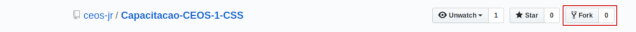
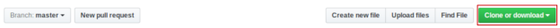

# Módulo CSS

Seja bem vindos ao módulo CSS. Você pode falar "De novo isso?" ou "Não aguento mais CSS!".
Mas sim, CSS de novo, só que agora vamos abordar features dessa tecnologia que vão ajudar você a entender
melhor o processo de estruturação de uma página e assim estar mais preparado para os diversos problemas de estilização que podem aparecer. Você não vai estar limitado a tecnologias como bootstrap para resolver seus problemas.

Nesse módulo, vamos seguir a seguinte jornada:

1. [Seletores, Especificidade, Cascata e Herança](https://peight.github.io/CSS-training/part-one).
2. Posicionamento CSS.
3. Flexbox layout.
4. Grid layout.
5. Media Queries.

## Enviando exercícios

Alguns módules possuem exercício. Cada repositório tem suas pastas de exercício junto com seus arquivos vazios para você começar a escreve seu código. Mas antes de começar a resolver as tarefas, você precisa dar um **fork** no repositório. Clique no botão que se encontra no canto superior direito da página. Veja a imagem abaixo:



Forkado o projeto, copie o link que se encontra no repositório forkado.



Abra seu terminal e baixe o projeto digitando o seguinte comando:

```shellscript
$ git clone <link-copiado>
```

Feito isso, crie seu branch:

```shellscript
$ git checkout -b <nome-do-branch>
```

Agora sim você pode começar a fazer os exercícios. :heart_eyes:

Terminado as questões, crie um pull request....

## Licença

[MIT](https://github.com/pEight/CSS-training/blob/master/LICENSE)
