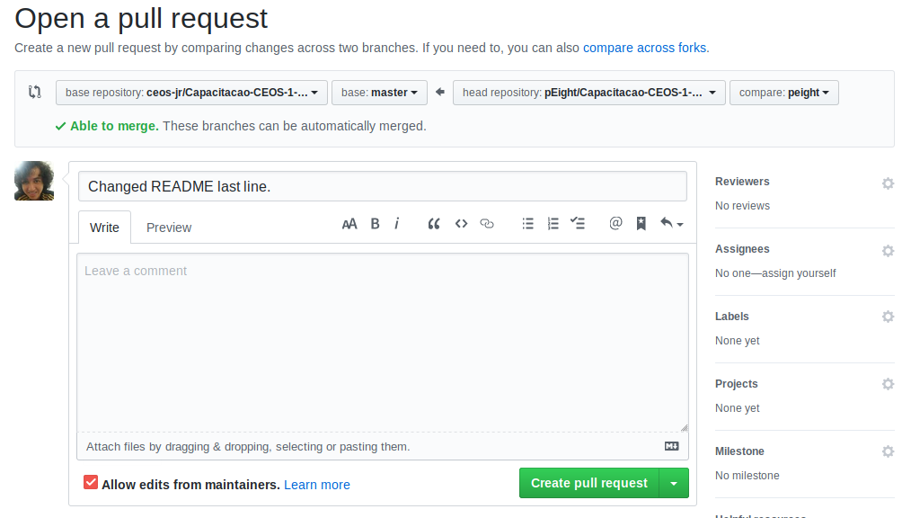

# Módulo CSS

Seja bem vindos ao módulo CSS. Você pode falar "De novo isso?" ou "Não aguento mais CSS!".
Mas sim, CSS de novo, só que agora vamos abordar features dessa tecnologia que vão ajudar você a entender
melhor o processo de estruturação de uma página e assim estar mais preparado para os diversos problemas de estilização que podem aparecer. Você não vai estar limitado a tecnologias como bootstrap para resolver seus problemas.

Nesse módulo, vamos seguir a seguinte jornada:

1. [Seletores, Especificidade, Cascata e Herança](https://ceos-jr.github.io/Capacitacao-CEOS-1-CSS/part-one).
2. [Posicionamento CSS](https://ceos-jr.github.io/Capacitacao-CEOS-1-CSS/part-two).
3. Flexbox layout.
4. Grid layout.
5. Media Queries.

## Enviando exercícios

Alguns módulos possuem exercícios. Cada repositório tem suas pastas de exercício junto com seus arquivos vazios para você começar a escreve seu código. Mas antes de começar a resolver as tarefas, você precisa dar um **fork** no repositório. Clique no botão que se encontra no canto superior direito da página.


Forkado o projeto, copie o link que se encontra no repositório forkado.


Abra seu terminal e baixe o projeto digitando o seguinte comando:

```shellscript
$ git clone <link-copiado>
```

Então crie seu branch:

```shellscript
$ git checkout -b <nome-do-branch>
```

Agora sim você pode começar a fazer os exercícios. :heart_eyes:

Terminado as questões, crie um commit com o git e envie suas alterações para o branch remoto com o nome `<nome-do-branch>`. Para fazer esse envio, basta usar o comando abaixo:

```shellscript
$ git push origin <nome-do-branch>
```

Agora vamos criar o Pull request. Vá no repositório do módulo que está no [github da CEOS](https://github.com/ceos-jr). Clique no botão `New pull request`:


Quando feito isso, o Github vai direcionar para uma página em que você deve clicar no seguinte link:


Quando clicado, teremos algo como a imagem abaixo:



Para enteder o que você deve fazer agora, observe a imagem abaixo e sua legenda.


Legenda:
 - No retângulo vermelho, temos o repositório para onde você quer enviar suas alterações.
 - No retângulo verde, temos o branch do repositório que você quer enviar suas alterações.
 - No retângulo azul, temos o repositório forkado que você criou anteriormente.
 - No retângulo rosa, temos o branch que você realizou as alterações commitou e enviou para o repositório forkado.

Entendido a legenda, selecione os repositórios e branchs corretos, adicione uma descrição caso queira e clique em `Create pull request`. Analisaremos sua questão e informaremos na `issue` da questão se a resolução foi feita corretamente.

## Licença

[MIT](https://github.com/pEight/CSS-training/blob/master/LICENSE)
