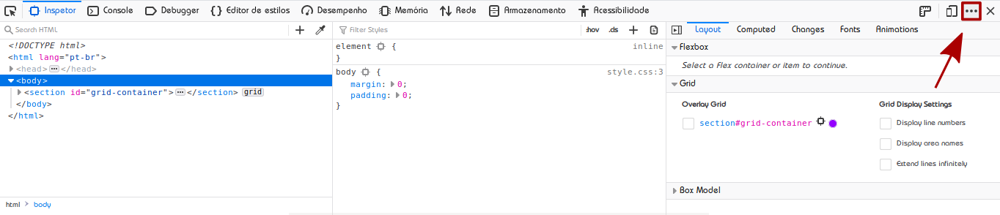
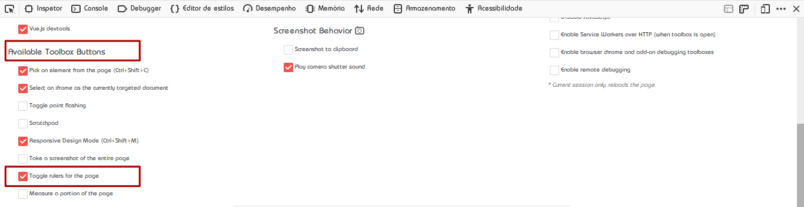
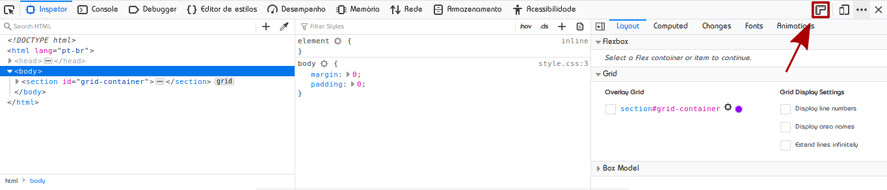
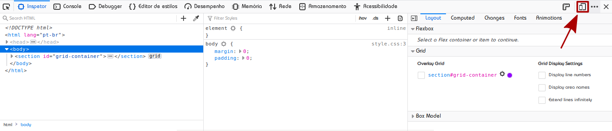
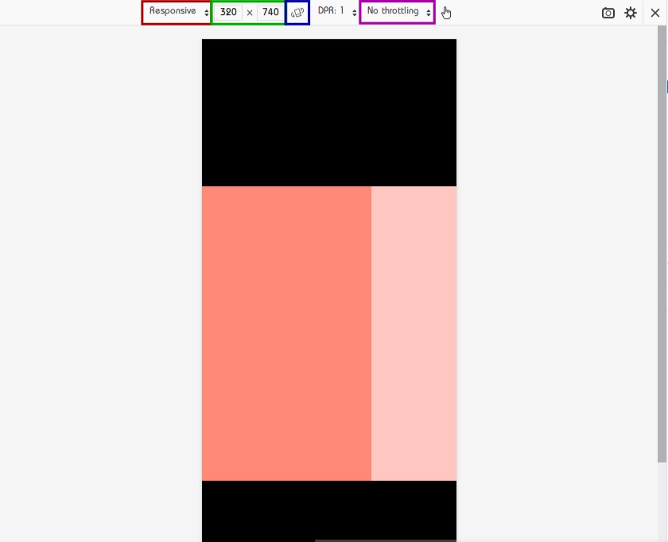

# Media Queries

Faz mais de uma década, eu acredito, que surgiram os smartphones. Diferentes tamanhos de telas, tanto desses dispositivos como também de monitores tornou a vida para quem produz conteúdo web um pouco mais complexa. Agora precisamos pensar em layouts que se adaptem para diferentes resoluções. Mas não ache que estou querendo lhe assustar apresentando esse pensamento de desenvolvimento. Construir aplicações que suporte diferentes tamanhos  de telas não é um bicho de sete cabeças se você entende bem o CSS.

## Conceitos

Media Querie é uma ferramenta fornecida pelo CSS para aplicação de regras de estilo para um determinado dispositivo com determinada caracteristica que você, autor, define. Antes de falarmos como criar media queries, vamos aprender a utilizar algumas ferramentas de desenvolvimento do firefox.

A primeira coisa que você deve fazer é aprender o atalho para abrir ass ferramentas de desenvolvimento do firefox. Para fazer isso, pressione `Ctrl+Shift+i`. Observe que aparece uma barra embaixo do conteúdo. A segunda coisa que devemos fazer é ativar a régua do firefox. Para isso clique nos três pontos no canto superior direito dessa barra. Depois clique em `settings`, role até encontra o título **Available Toolbox Buttons** e marque a opção **Toogle rules for the page**. Veja as imagens abaixo:

<p align="center">
	
</p>

<p align="center">
	
</p>

Agora, você pode selecionar uma régua que informa o tamanho da `viewport`. Basta clicar!

<p align="center">
	
</p>

Outra ferramenta muito útil é a de simulação de tamanho de um smartphone. Ela nos ajuda a visualizar nosso site como se estivessemos no dispositivo.

<p align="center">
	
</p>

Então:
<p align="center">
	
</p>

Legenda:
- No retângulo vermelho você pode selecionar qual dispositivo deseja simular.
- No retângulo verde você decide a largura e altura do dispositivo.
- No retângulo azul você muda a orientação do dispositivo.
- No retângulo roxo você seleciona a conexão que deseja simular(2G, 3G, 4G).

Agora que conhecemos essa ferramentas, vamos finalmente começar media queries. Media Querie é recurso do CSS para aplicação de regra de estilo a um determinado tipo de mídia e funcionalidade de mídia. Mas como é uma media querie? Veja o código abaixo:

```css
@media screen and (max-width: 700px) {
	body {
		background-color: #000;
	}
}
```

Analisando a estrutura de uma media querie, temos 4 itens que lhe da a forma. A palavra chave `@media`, o tipo de mídia que no exemplo acima é `screen`, um operador como `and` e uma funcionalidade de mídia como `max-width`. 

**Observação**: Não é obrigatório definir o tipo de mídia.

A mudança do fundo da cor para preto no exemplo acima só vai ocorrer quando a largura da `viewport` for menor ou igual a `700px`. Observando, agora podemos encaixar as peças. Isso não seria útil para definir certo tipo de layout ou tamanho de fonte para o smartphone, enquanto para o computador definimos outro valor? Sim. É exatamente para isso que usamos media queries.

```html
<h1>Media Queries</h1>
```

```css
body { text-align: center; }

h1 { color: #f3a; }

@media screen and (max-width: 700px) {
	h1 {
		color: #ea6;
	}
}
```

> **Exercício sugerido**:
> Teste o código acima. O que acontece quando você diminui a largura da tela?

**Observação**: as regras de cascata são válidas também para regras de estilo dentro de media queries. Lembre dos passos ensinado na primera seção.

> **Exercício sugerido**:
> Baseado na observação feita acima, você é capaz de responder porque a media querie do exemplo está no fim do arquivo?

## Tipos de mídia

Para os tipos de mídias, os navegadores não têm muito suporte. Por isso normalmente deixamos sem nenhum valor ou apenas com:
- `screen`
- `all`

Para saber quais os tipos de mídia, acesse esse [link](http://cssmediaqueries.com/what-are-css-media-queries.html), mas observe que alguns são bem inúteis para o propósito de construção de conteúdo para mobile ou não tem o funcionamento correto.

## Operadores

| Operador | Descrição |
| -------- | --------- |
| A `and` B | A media querie é `true` se A e B são verdadeiros. |
| `not` A | A media querie é `true` se A é `false` | 

## Funcionalidade de mídia

| Funcionalidade de mídia | Descrição |
| ----------------------- | --------- |
| `width` | Essa funcionalidade de mídia aceita os prefixos `min-` e `max-`. Ela indica a largura da `viewport` considerando conteúdo que pode ser visto ao fazer o rolamento(scroll) horizontal do navegador. |
| `height` | Essa funcionalidade de mídia aceita os prefixos `min-` e `max-`. Ela indica a altura da `viewport` considerando conteúdo que pode ser visto ao fazer o rolamento(scroll) vertical do navegador. |
| `device-width` | Essa funcionalidade de mídia aceita os prefixos `min-` e `max-`. Ela indica a largura da tela do dispositivo. |
| `device-height` | Essa funcionalidade de mídia aceita os prefixos `min-` e `max-`. Ela indica a altura da tela do dispositivo. |
| `aspect-ratio` | Se baseia na razão entre largura e altura da `viewport`, ou seja, ela considera conteúdo oculto mas que pode ser visto ao rolar/"scrollar" horizontalmente ou verticalmente. |
| `device-aspect-ratio` | Se baseia na razão entre largura e altura da tela do dispositivo. |
| `resolution` | Indica a densidade de pixels do dispositivo. Podemos passar um número inteiro positivo com as unidades `dpi`. |
| `orientation` | Se baseia na orientação do dispositivo. `landscape` para casos em que a largura é maior que a altura e `portrait` para casos em que a altura é maior que a largura. |

**Observação 1**: A funcionalidade de mídia `orientation: landscape` é definida como true para monitores também. O que é um grande problema para caso queiramos que se aplique apenas pela orientação do smartphone ou tablet. 

**Observação 2**: As funcionalidades de mídia mais utilizadas são `width` e `height` junto dos prefixos `min-` ou `max-`.

## Breakpoint

Você pode pensar que uma ideia vai da cabeça para o código. A maioria das vezes essa não é uma abordagem interessante. Quando falamos em construir layouts, essa ideia se torna pior ainda. Normalmente, em desenvolvimento de sites, temos uma parte que é específica para desenhar as telas. Ela é conhecida como criação de mockups e é feita em um editor de imagens como illustrator, photoshop, gravit ou inkscape. Porém esse caminho é o primeiro caso você queira ter mais dificuldades no CSS. Antes de tudo, é essencial definirmos os **breakpoints**. Ou seja, os tamanhos de tela em que teremos uma alteração significativa.

Seja l uma largura. Os breakpoints vão ser definidos baseado na largura l. Logo:

- Para l <= 320px, temos um modelo w.
- Para 320 < l <= 1024, temos um modelo x.
- Para 1024 < l <= 1600, temos um modelo y.
- Para l > 1600, temos um modelo z.

Eu, autor, recomendo dar nomes para cada breakpoint, objetivando uma comunicação em time mais fluida.

**Observação**: o sinal <= significa menor ou igual.

## Exemplo possivelmente útil

O código é um exemplo de media queries aplicado a fonte baseado na largura da `viewport`. Teste em seu navegador e busque entender a unidade `em` em conjunto com media queries.

```html
<h1>Media Queries</h1>
<p>Lorem ipsum dolor sit amet, consectetur adipiscing elit. Donec vel velit sit amet arcu semper suscipit ut eu lorem. Donec molestie enim at ipsum porttitor tincidunt sed vitae nisl. Proin ac lorem et felis consectetur tempor at in quam. Quisque feugiat pellentesque vestibulum. Pellentesque ac posuere mi, in posuere justo. Duis nec ultrices lorem. Pellentesque blandit enim sit amet facilisis tincidunt. Sed iaculis nec augue in egestas. Donec imperdiet justo eget pharetra consequat. Donec neque leo, posuere sit amet maximus vitae, viverra sed metus. Curabitur accumsan vel odio eget fermentum. Duis imperdiet enim ac ante luctus egestas. Fusce posuere dui ex. Nam facilisis velit leo. Nam vel ultrices diam, et suscipit lacus. </p>
```

```css
body { font-size: 16px; }

h1 {
	color: #f3a;
	font-size: 3em;
	text-align: center;
}

p {
	color: #ea6;
	font-size: 1.8em;
	text-align: justify;
}

@media (max-width: 780px) {
	body { font-size: 10px }
	h1 { color: #ea6; }
	p { color: #f3a; }
}

@media (max-width: 320px)  {
	h1 { color: #f3a; }
	p { color: #ea6; }
}
```