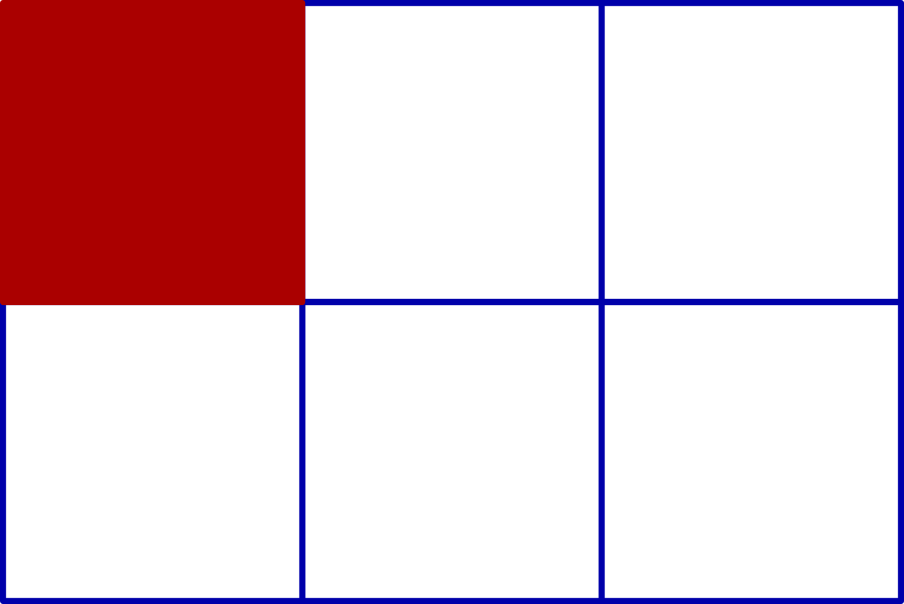
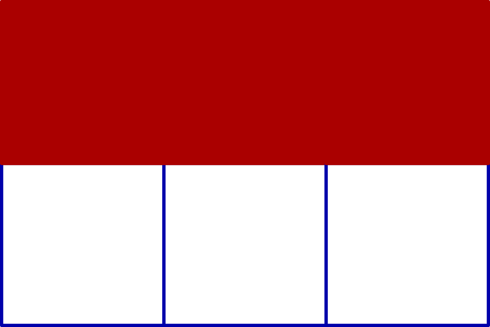
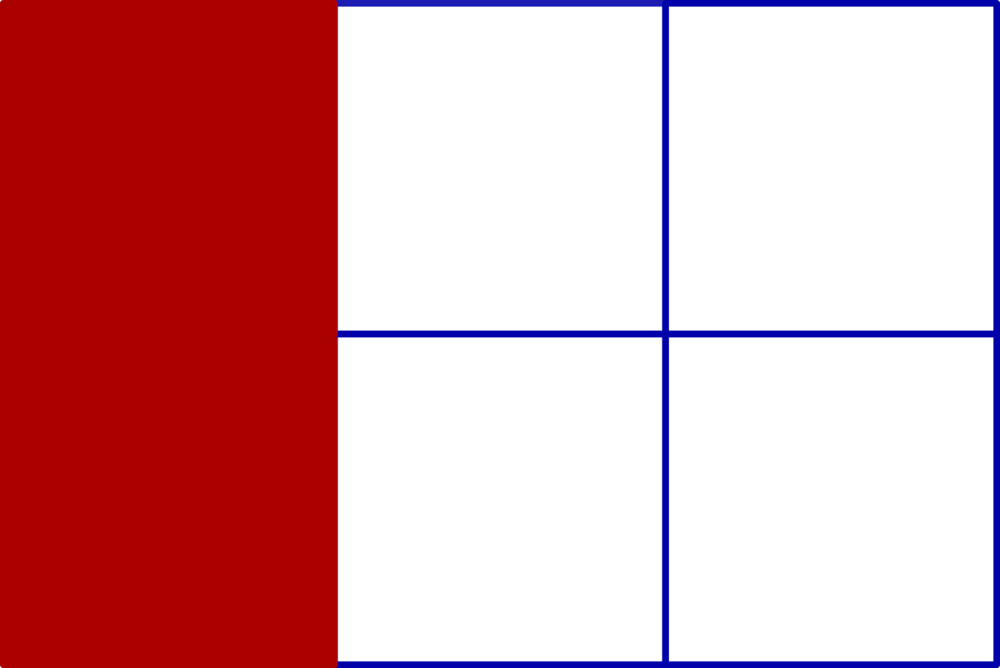
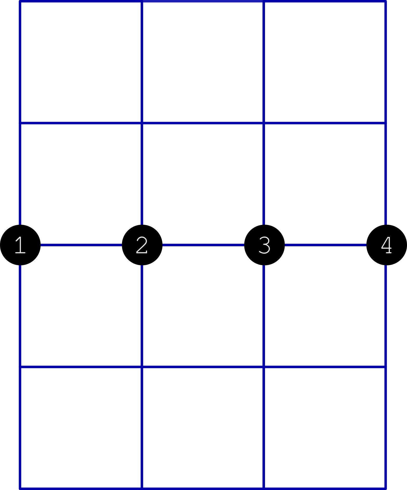
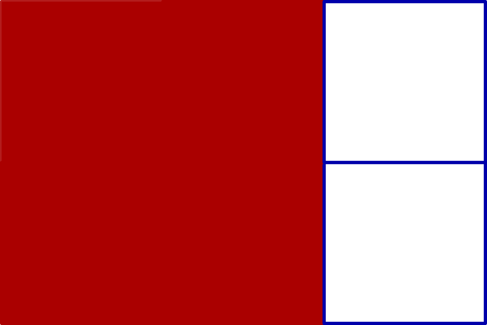
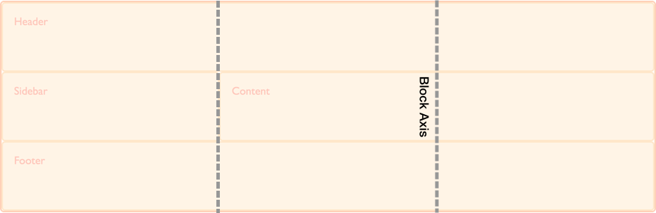

# Grid layout

Como já foi mencionado em seções anteriores, a evolução do CSS desde sua criação nos forneceu especificações para criação de layouts. Falamos de flexbox layout e agora vamos introduzir a especificação de grid layout. Esperamos que no fim dessa seção, você esteja pronto para estruturar seu site com um CSS manutenível.

## Conceitos

Grid layout é uma especificação que trouxe um sistema bidimensional para criação de layouts. Nele, temos um conjunto de linhas horizontais e outro conjunto de linhas verticais que juntos formam um **grid**. Pense em um grid como se fosse uma tabela no excel. 

**Observação**: No texto acima falamos de linhas horizontais e linhas verticais. Não confunda esses termos com linhas e colunas. Explicaremos mais adiante o que é uma linha e coluna no Grid layout.

Quando declaramos a propriedade `display: grid` em um elemento, criamos um **grid container**. Nele é formado um **grid** e todos os seus filhos passam a ser um **grid item**.

```html
<section id="grid-container">
	<header></header>
	<main></main>
	<aside></aside>
	<footer></footer>
</section>
```

```css
#grid-container {
	display: grid;
}
```

Por enquanto, o código acima não possui nenhuma diferença do que nós ja vimos. Isso ocorre porque para esse grid container, temos apenas uma **célula**. Por definição, esse termo se refere a área formada por linhas horizontais paralelas mais próximas e linhas verticais mais próximas. Uma célula é a menor unidade de um grid. Observe a imagem abaixo:



Um conjunto de células horizontais ou verticais formam o nosso **grid track**. Observe que um **grid-track** formado por células verticais definem nossa **coluna**. Caso seja formado por células horizontais, temos uma **linha**.





Para definir essas linhas e colunas, dentro do nosso grid container, definimos as propriedades `grid-template-rows` para criação de linhas e `grid-template-columns` para criação de colunas.

```html
<section id="grid-container">
	<header></header>
	<main></main>
	<aside></aside>
	<footer></footer>
</section>
```

```css
#grid-container {
	display: grid;
	grid-template-columns: 1fr 1fr 1fr;
	grid-template-rows: 1fr 1fr 1fr 1fr;
}
```

Nesse código, ao utilizar `grid-template-columns: 1fr 1fr 1fr`, estamos definindo 3 colunas em que cada uma tem a largura de 1 fração do espaço disponível. Ou seja, 1/3 para a primeira coluna, 1/3 para a segunda e 1/3 para a terceira. O mesmo ocorre com a utilização de `grid-template-rows: 1fr 1fr 1fr 1fr`. Na declaração dessa propriedade, criamos 4 linhas em que cada uma tem a altura de 1 fração do espaço disponível. Ou seja, 1/4 para a primeira linha, 1/4 para a segunda, 1/4 para a terceira e 1/4 para a quarta.

Lembra que mencionamos que linhas são diferentes do conceito de linhas horizontais e colunas são diferentes do conceito de linhas verticais? Agora vamos ver exatamente porque essa diferença de nomeclatura. Observe de novo a seguinte declaração: `grid-template-columns: 1fr 1fr 1fr`. Aqui sabemos que temos 3 colunas, mas essas colunas são formadas por um conjunto de linhas verticais e para formar três colunas, precisamos de 4 linhas verticais. Portanto, para essa linha de código, temos 3 colunas e 4 linhas verticais. Saber a diferença desses dois conceitos é muito importante para saber como posicionar os grid items nas células correta.



> **Exercício sugerido**:
> Quantas linhas horizontais temos ao declarar `grid-template-rows: 1fr 1fr 1fr 1fr`?

**Observação**: Caso você utilize o navegador firefox, nas ferramentas de desenvolvimento você pode ativar a malha visual para saber se realmente foram criadas a quantidade correta de linhas e colunas.


Uma **grid area** é formada por um conjunto de células não necessariamente formando uma linha ou uma coluna. Veja a imagem abaixo:



## Posicionamento de grid items

Agora podemos posicionar nossos grid items em qualquer posição da malha, formando assim uma área. Para fazer isso, precisamos conhecer as propriedades `grid-column-start`, `grid-column-end`, `grid-row-start` e `grid-row-end`.

`grid-column-start` e `grid-column-end` definem respectivamente a linha vertical do início e do fim. Enquanto `grid-row-start` e `grid-row-end` definem respectivamente a linha horizontal do início e do fim.

Vamos posicionar os elementos a seguir buscando colocar o `header` em toda parte superior do site, o conteúdo principal em 2/3 dos espaço disponível, o conteúdo lateral em 1/3 do espaço disponível e o footer embaixo de tudo.

```html
<section id="grid-container">
	<header></header>
	<main></main>
	<aside></aside>
	<footer></footer>
</section>
```

```css
@charset "utf-8";

body {
	margin: 0;
	padding: 0;
}

#grid-container {
	height: 100vh;
	display: grid;
	grid-template-columns: 1fr 1fr 1fr;
	grid-template-rows: 1fr 1fr 1fr 1fr;
}

header {
	grid-column-start: 1;
	grid-column-end: 4;
	grid-row-start: 1;
	grid-row-end: 2;

	background-color: #000;
}

main {
	grid-column-start: 1;
	grid-column-end: 3;
	grid-row-start: 2;
	grid-row-end:4;

	background-color: #f87;
}

aside {
	grid-column-start: 3;
	grid-column-end: 4;
	grid-row-start: 2;
	grid-row-end: 4;
	background-color: #f877;
}

footer {
	grid-column-start: 1;
	grid-column-end: 4;
	grid-row-start: 4;
	grid-row-end: 5;
	background-color: #000;
}
```

Vamos ter:


Para as quatro propriedades faladas acima, temos alguns shorthand que diminuem a quantidade de código escrito. Eles são o `grid-column` e `grid-row` Veja o código abaixo para saber como utilizá-las.

```html
<section id="grid-container">
	<header></header>
	<main></main>
	<aside></aside>
	<footer></footer>
</section>
```

```css
body {
	margin: 0;
	padding: 0;
}

#grid-container {
	height: 100vh;
	display: grid;
	grid-template-columns: 1fr 1fr 1fr;
	grid-template-rows: 1fr 1fr 1fr 1fr;
}

header {
	grid-row: 1 / 2;
	grid-column: 1 / 4;
	background-color: #000;
}

main {
	grid-row: 2 / 4;
	grid-column: 1 / 3;
	background-color: #f87;
}

aside {
	grid-row: 2 / 4;
	grid-column: 3 / 4;
	background-color: #f877;
}

footer {
	grid-row: 4 / 5;
	grid-column: 1 / 4;
	background-color: #000;
}
```

Observe que o `grid-row` é a junção das propriedades `grid-row-start` e `grid-row-end`, enquanto o `grid-column` é a junção das propriedades `grid-column-start` e `grid-column-end`.

Ainda sim, caso você ache esse método muito verboso, temos as propriedades `grid-template-areas` e `grid-area`. Veja o mesmo código acima, mas agora usando essas duas propriedades.

```html
<section id="grid-container">
	<header></header>
	<main></main>
	<aside></aside>
	<footer></footer>
</section>
```

```css
body {
	margin: 0;
	padding: 0;
}

#grid-container {
	height: 100vh;
	display: grid;
	grid-template-areas: 
	"hd hd hd"
	"mn mn as"
	"mn mn as"
	"ft ft ft";
}

header {
	grid-area: hd;
	background-color: #000;
}

main {
	grid-area: mn;
	background-color: #f87;
}

aside {
	grid-area: as;
	background-color: #f877;
}

footer {
	grid-area: ft;
	background-color: #000;
}
```

Logo, o `grid-area` serve para nomear os grid items e o `grid-template-areas` serve para posicionar os elementos e definir o número de linhas e colunas. Portanto não é necessário as propriedades `grid-template-rows` e `grid-template-columns`.

Em alguns casos, você pode precisar definir um espaçamento entre as colunas e as linhas. Basta utilizar `grid-column-gap` e `grid-row-gap` que você consegue esse tipo de comportamento. No exemplo anterior, defina `grid-column-gap: 10px` e `grid-row-gap: 50px` no grid container.

## Alinhamento

Muito parecido com o sistema de alinhamento de flexbox layout, o grid layout possui dois eixos imaginários. Um na vertical chamado de **block axis** e outro na horizontal conhecido como **inline axis**.




Com as propriedades `align-items` e `align-self` conseguimos realizar o alinhamento pelo block axis. O `align-items` realiza o alinhamento do conjunto de grid items. A tabela abaixo mostra os valores que essa propriedade pode receber:

| Valor | Descrição |
| ----- | --------- |
| `start` | Alinha os grid items no início da parte superior de cada célula. |
| `center` | Alinha os grid items no centro do block axis de cada célula. |
| `end` | Alinha os grid items no fim da parte inferior de cada célula. |
| `stretch` | Os grid items buscam se esticar por todo o block axis. |

Já o `align-self` realiza o alinhamento de um determinado grid item. Ele recebe os mesmos valores que o `align-items`.

Para alinhar baseado no inline axis, usamos as propriedades `justify-content` e `justify-self`.
Assim com explicado nas propriedades de alinhamento no block axis, o `justify-content` alinha todos os grid items em relação a célula, enquanto o `justify-self` realiza o alinhamento de um determinado grid item em relação a célula. Elas recebem os memos valores apresentado na tabela acima. Busque testar essas 4 propriedades para tirar suas próprias conclusões.

## Observações finais

Nem todas a propriedades da especificação de grid layout foram mencionadas. Busquei apenas apresentar aquelas que são mais importantes para criação de layouts. Tente ver quais outras propriedades existem e como aplicá-las em algum problema de desenvolvimento web do seu dia.

A propriedade `float` não funciona em grid items. Lembre-se que grid items são filhos de um grid container.

Para mover grid items com `left` e `top`, é preciso primeiro definir ao grid container a propriedade `position: relative;`. Depois devemos definir um `position` para o grid item que queremos mover.