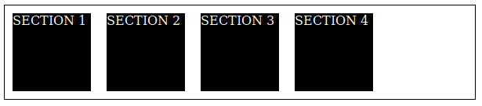
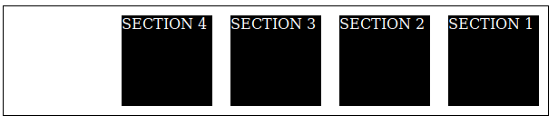

# Flexbox layout

Realizar a construção de layouts em CSS apenas com posicionamento CSS que se adapte a todo tipo de dispositivo é algo que acaba tomando uma enorme complexidade. Ao longo dos anos, a tecnologia foi evoluindo e nesse processo surgiu especificações para criação de layouts de uma forma menos maçante. A primeira delas que abordaremos é a Flexbox layout. Ela foi adicionada buscando ajudar na criação de layouts em sistema unidimensional.

Nas Flexboxs, existem alguns termos técnicos que nos ajudam a entender melhor seu comportamento. É extremamente importante que você fixe essas ideias antes de seguir para a prática, pois tanto esse termos vão lhe garantir um entendimento melhor para correção de bugs de layout, como também uma boa evolução técnica. Então vamos começar.

Quando declaramos a propriedade `display: flex` para um elemento, ele passa a ser um **flex container**, enquanto que seus filhos passam a ser **flex items**. É criado dois eixos imaginários, o **main-axis** e o **cross-axis**. Quando a propriedade `flex-direction` recebe o valor `row`, o main-axis é um eixo horizontal enquanto o cross-axis é o eixo vertical que fica perpendicular ao main-axis. Caso essa propriedade receba o valor `column`, o main-axis é o eixo vertical, enquanto o cross-axis é o eixo horizontal perpendicular ao main-axis. Por padrão, quando você torna um elemento flex container, a propriedade `flex-direction` recebe o valor de `row`. 

<p align="center">
	 
</p>

<p align="center">
	
</p>

A tabela abaixo mostra quais valores `flex-direction` pode receber:

| Valor | Descrição | Imagem |
| ----- | --------- | ------ |
| `row`   | Main-axis é o eixo horizontal e os elementos começam do início desse eixo, ou seja, na esquerda |  |
| `row-reverse` | Main-axis continua sendo o eixo horizontal, mas agora os elementos começam da direita do eixo |  |
| `column` | Main-axis passa a ser o eixo vertical e os elementos começam da parte superior do eixo | <p align="center"></p> |
|`column-reverse` | Main-axis continua sendo o eixo vertical e os elementos começam da parte inferior do eixo | <p align="center"></p> |

Os flex items, por padrão, se expandem no cross-axis, mas não fazem isso no main-axis. No eixo principal, eles podem apenas diminuir de tamanho de acordo com o tamanho da `viewport`.

Observe o código abaixo:

```html
<section id="flex-container">
	<section class="flex-items">SECTION 1</section>
	<section class="flex-items">SECTION 2</section>
	<section class="flex-items">SECTION 3</section>
	<section class="flex-items">SECTION 4</section>
</section>
```

```css
#flex-container {
	display: flex;
	border: 1px solid #000;
}

.flex-items {
	max-width: 100px;
	height: 100px;
	margin: 10px;
	background-color: #000;
	color: #fff;
}
```

> **Exercício sugerido**:
> O que ocorre quando você vai diminuindo a largura do seu navegador, ou seja, a largura da `viewport`? Defina uma largura fixa para o `#flex-container`. O que ocorre? Agora defina uma largura fixa para o `.flex-items`. O que ocorre? Agora aplique a propriedade `flex-wrap` com valor `wrap` ao flex container. O que acontece quando você diminui a tela do navegador?

Resolva o exercício anterior para entender o comportamento da propriedade `flex-wrap`. Anote, pois pode ser uma propriedade que resolve muito de seus problemas na construção de layouts responsivos.

> **Exercício proposto**:
> Preencha a tabela abaixo para cada valor que `flex-wrap` pode receber:

| Valor        | Descrição  |
| ------       | ---------  |
| `nowrap`       | (resposta) |
| `wrap`         | (resposta) |
| `wrap-reverse` | (resposta) |

Quando passado o valor `wrap` ou `wrap-reverse` a propriedade `flex-wrap`, os flex items tentam se encaixar no flex-container, mas caso não consigam, é criada outra linha imaginária. Esse acontecimento é muito importante para as propriedades de alinhamento que o flexboy layout nos fornece.

No código abaixo, ao usar `justify-content: center` no flex container, os flex-items vão centralizar no main-axis. Logo, justify-content é uma propriedade que busca alinhar os flex-items no eixo principal. Veja que o eixo principal é relativo ao valor `flex-direction`. Então, ao usar essa propriedade, tenha em mente quem é o main-axis.

```html
<section id="flex-container">
	<section class="flex-items">SECTION 1</section>
	<section class="flex-items">SECTION 2</section>
	<section class="flex-items">SECTION 3</section>
	<section class="flex-items">SECTION 4</section>
</section>
```

```css
#flex-container {
	display: flex;
	border: 1px solid #000;
	width: 700px;
	justify-content: center;
}

.flex-items {
	width: 100px;
	height: 100px;
	margin: 10px;
	background-color: #000;
	color: #fff;
}
```

<p align="center">
	
</p>

Segue abaixo uma tabela com os valores que `justify-content` pode receber. Busque testar cada valor para tirar suas próprias conclusões.

| Valor | Descrição |
| ----- | --------- |
| `flex-start` | Os elementos são alinhados no início do main-axis. Lembre que esse início é relativo. Ele depende do valor de `flex-direction` ser `row` ou `row-reverse`. |
| `flex-end` | Os elementos são alinhados no fim do main-axis. |
| `center` | Os elementos ficam centralizados horizontalmente. |
| `space-between` | Os elementos buscam ter um espaçamento maior entre seus irmãos. |
| `space-around` | Os elementos buscam ter um espaçamento maior ao seu redor |

Agora você pode se perguntar qual propriedade usamos para alinhar baseado no cross-axis. Para esse eixo, a especificação de flexbox layout nos fornece duas propriedades: `align-items` e `align-content`. A primeira vai alinhar os flex items baseado no eixo perpendicular. A segunda propriedade você só vai funcionar caso exista mais de uma linha. Ou seja, `flex-wrap` é `wrap` e todo o conteúdo nao coube na mesma linha. Para o `align-content` funcionar, é preciso também que a altura do flex-container seja maior que a soma da altura das linhas.

```html
<section id="flex-container">
	<section class="flex-items">SECTION 1</section>
	<section class="flex-items">SECTION 2</section>
	<section class="flex-items">SECTION 3</section>
</section>
```

```css
#flex-container {
	display: flex;
	border: 1px solid #000;
	height: 500px;
	align-items: flex-end;
}

.flex-items {
	width: 100px;
	margin: 10px;
	background-color: #000;
	color: #fff;
}

.flex-items:nth-child(1) { height: 50px; }
.flex-items:nth-child(2) { height: 70px; }
.flex-items:nth-child(3) { height: 30px; }
```

A seguinte configuração será mostrada:

<p align="center">
	
</p>

> **Exercício sugerido**:
> Mude de `align-items` para `align-content`. O que ocorre?

Agora, usando `align-content` no exemplo abaixo:

```html
<section id="flex-container">
	<section class="flex-items">SECTION 1</section>
	<section class="flex-items">SECTION 2</section>
	<section class="flex-items">SECTION 3</section>
	<section class="flex-items">SECTION 4</section>
	<section class="flex-items">SECTION 5</section>
	<section class="flex-items">SECTION 6</section>
	<section class="flex-items">SECTION 7</section>
	<section class="flex-items">SECTION 8</section>
	<section class="flex-items">SECTION 9</section>
	<section class="flex-items">SECTION 10</section>
</section>
```

```css
#flex-container {
	display: flex;
	flex-wrap: wrap;
	border: 1px solid #000;
	width: 400px;
	height: 500px;
	align-content: flex-end;
}

.flex-items {
	width: 100px;
	margin: 10px;
	background-color: #000;
	color: #fff;
}

.flex-items:nth-child(even) { height: 50px; }
.flex-items:nth-child(odd) { height: 70px; }
```

Temos então:

<p align="center">
	
</p>

Mudando de `align-content` para `align-items`, vamos ter algo como mostra a imagem abaixo:

<p align="center">
	
</p>

> **Exercício sugerido**:
> Qual a diferença que você observou entre essas duas propriedades?

Para `align-items` podemos receber os valores mostrado na tabela abaixo. Busque testar cada um e tirar suas próprias conclusões.

| Valor | Descrição |
| ----- | --------- |
| `stretch` | Busca preencher todo o cross-axis. |
| `flex-start` | Alinha os itens no início do cross-axis. |
| `flex-end` | Alinha os itens no fim do cross-axis. |
| `center` | Alinha os itens no centro do cross-axis. |
| `baseline` | Alinha os itens de acordo com a linha base da tipografia. |

Para `align-content` podemos receber os valores mostrado na tabela abaixo. Busque testar cada um e tirar suas próprias conclusões.

| Valor | Descrição |
| ----- | --------- |
| `stretch` | Busca preencher todo o cross-axis. |
| `flex-start` | Alinha todas as linhas no início do cross-axis |
| `flex-end` | Alinha todas as linhas no fim do cross-axis. |
| `center` | Alinha todas as linhas no centro do cross-axis. |
| `space-between` | Alinha todas as linhas buscando deixar um espaço maior entre elas |
| `space-around` | Alinha todas as linhas buscando deixar um espaço maior ao redor delas |


Algumas propriedades da especificação de flexbox layout foram adicionadas para serem aplicadas nos flex items. Isso permite que você trabalhe individualmente com cada item. As propriedades são `flex-grow`, `flex-shrink`, `order` e `align-self`.

Como você ja deve ter notado, os elementos filhos se tornam flexíveis ao tamanho da tela quando você diz que o elemento pai é um flex container. Por padrão essa flexibilidade aumenta o tamanho do elemento filho em uma mesma proporção. Porém, com a propriedade `flex-grow` você consegue mudar esse comportamento. Todo flex item tem essa propriedade com o valor `1`. Logo, aumentando esse valor para um determinado item, ele vai ter uma taxa de aumento maior. O mesmo ocorre na diminuição do tamanho em que você pode definir para a propriedade `flex-shrink` a taxa de diminuição de um determinado flex item. Por padrão, `flex-shrink` é 1 para todos os flex items.

Podemos também definir a ordem dos elementos com `order`. Veja o exemplo abaixo:

```html
<section id="flex-container">
	<section class="flex-items">SECTION 1</section>
	<section class="flex-items">SECTION 2</section>
	<section class="flex-items">SECTION 3</section>
	<section class="flex-items">SECTION 4</section>
	<section class="flex-items">SECTION 5</section>
</section>
```

```css
#flex-container {
	display: flex;
	border: 1px solid #000;
	align-content: flex-end;
}

.flex-items {
	width: 100px;
	height: 100px;
	margin: 10px;
	background-color: #000;
	color: #fff;
}

.flex-items:nth-child(1) { order: 5; }
.flex-items:nth-child(2) { order: 2; }
.flex-items:nth-child(3) { order: 3; }
.flex-items:nth-child(4) { order: 4; }
.flex-items:nth-child(5) { order: 1; }
```

No navegador:

<p align="center">
	
</p>

Também é possível realizar o alinhamento pelo cross-axis de apenas um item. Observe o exemplo abaixo com a propriedade `align-self`

```html
<section id="flex-container">
	<section class="flex-items">SECTION 1</section>
	<section class="flex-items">SECTION 2</section>
	<section class="flex-items">SECTION 3</section>
	<section class="flex-items">SECTION 4</section>
	<section class="flex-items">SECTION 5</section>
</section>
```

```css
#flex-container {
	display: flex;
	border: 1px solid #000;
	align-content: flex-end;
	width: 600px;
	height: 300px;
}

.flex-items {
	width: 100px;
	margin: 10px;
	background-color: #000;
	color: #fff;
}

.flex-items:nth-child(1) { align-self: flex-start; }
.flex-items:nth-child(2) { align-self: flex-end; }
.flex-items:nth-child(3) { align-self: stretch; }
.flex-items:nth-child(4) { align-self: center; }
.flex-items:nth-child(5) { align-self: baseline; }
```

A renderização será como mostra na imagem abaixo:
<p align="center">
	
</p>

Para `align-self` podemos receber os valores mostrado na tabela abaixo. Busque testar cada um e tirar suas próprias conclusões.

| Valor | Descrição |
| ----- | --------- |
| auto | Segue o valor definido em `align-items` |
| stretch | Busca preencher todo o cross-axis. |
| flex-start | Alinha o elemento no início do cross-axis |
| flex-end | Alinha o elemento no fim do cross-axis. |
| center | Alinha o elemento no centro do cross-axis. |
| baseline | Alinha o item a linha da base. |

> **Exercício sugerido**:
> Eu, autor, não consegui ver qual o comportamente que acontece ao passar `baseline` para as propriedades de alinhamento. Busque uma resposta para essa dúvida. Gostaria muito de trocar uma ideia com que conseguir analisar bem esse valor.
