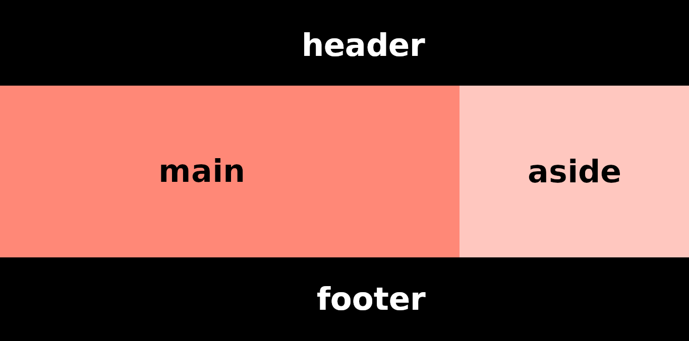

# Exercício Proposto

Segue uma lista de exercício com os conteúdos ensinado no módulo CSS. Siga o passo a passo de como mandar um exercício para a gente corrigir. Observe as issues. Ali você coloca o link do pull request criado da respectiva questão. Uma tabela será apresentada nas issues de cada exercício dizendo se você fez corretamente ou não. A legenda abaixo mostra o símbolo para casos de acerto perfeito, acerto e erro.

- :heavy_check_mark: (Acerto Perfeito)
- :o: (Acerto)
- :x: (Erro)

## Exercício 1
 Observe o código abaixo e complete a relação de parentesco abaixo:

```html
<html>
	<head>
		<meta charset="utf-8" />	
	</head>

	<body>
		<header>
			
			<nav>
				<ul>
					<li>Início</li>
					<li>Perfil</li>
					<li>Configurações</li>
				</ul>
			</nav>
		</header>

		<main>
			<h1>Meu produto</h1>
			<p>Algum texto sobre o meu produto</p>
		</main>

		<footer>
		</footer>
	</body>
</html>
```

1. `<meta charset="utf-8" />` é FILHO de `<head></head>`.
2. `<li>Configuração</li>` é DESCENDENTE de `<nav></nav>`.
3. `<li>Perfil</li>` é IRMÃO de `<li>Configuração</li>`.
4. `<li>Perfil</li>` é subsequente de <li>Início</li> .
5. `<main></main>` é filho de <body></body>.
6. `<footer></footer>` é irmão de <header></header>.
7. `<h1>Meu produto</h1>` é precedente de <p>Algum texto sobre o meu produto</p>.
8. `<p>Algum texto sobre o meu produto</p>` é DESCENDENTE de `<html></html>`..
9. `<ul></ul>` é PAI de `<li></li>`.
10. `<head></head>` é IRMÃO de `<body></body>`.

## Exercício 2

Para os seletores abaixo, diga qual o tipo dele.

1. `body { ... }`. SELETOR DE TIPO
2. `li:hover { ... }`. SELETOR DE PSEUDO-CLASSE
3. `p::before { ... }`. SELETOR DE PSEUDO-ELEMENTO
4. `body ul li { ... }`. SELETOR DE ESPECIFICIDADE
5. `.section-item { ... }`. SELETOR DE CLASSE
6. `section[class^="section-item"] { ... }`. SELETOR DE ATRIBUTO

## Exercício 3

Dado os seletores abaixo, forme o número de especificidade.

1. `body ul li { ... }`. 0003
2. `.section-item > p`. 0011
3. `head + body { ... }`. 0002
4. `#section-father ul li::before { ... }`. 0102
5. `section ul li:hover { ... }`. 0012

## Exercício 4

Dado o html abaixo, analise os itens com css e diga qual regra se aplica não levando em consideração a ordem na folha de estilo, ou seja, ignorando o 4 item do cálculo do efeito cascata.

```html
<header>
	
	<nav id="navbar">
		<ul id="navbar-list">
			<li class="navbar-item">Início</li>
			<li class="navbar-item">Perfil</li>
			<li class="navbar-item">Configurações</li>
		</ul>
	</nav>
</header>
```

1. 
```css
	#navbar ul { ... } --> 0201
	nav ul { ... } --> 0002
	header nav ul { ... } --> 0003
```

2.
```css
	nav ul li { ... } --> 0003
	header nav ul li { ... } --> 0004
	.navbar-item { ... } --> 0010
```

3.
```css
	nav ul .navbar-item { ... } --> 0012
	.navbar-item { ... } --> 0010
	nav[id="navbar"] ul li { ... } --> 0012
```
O ITEM "3" É O ÚNICO QUE TEM 2 SELETORES COM NÚMERO IGUAL DE PRIORIDADE, FAZENDO-SE NECESSÁRIO, PORTANTO, O USO DO ITEM 4 DO CÁLCULO DE EFEITO CASCATA. DESSE MODO, OS ITENS QUE IGNORAM-NO SÃO OS ITENS "1" E "2".

## Exercício 5

Em alguns sites nós temos um botão redondo com uma seta para cima que ao ser clicado, a tela volta para o início do site. Normalmente ele fica no canto inferior direito da tela. Crie um botão dessa forma e posicione-o nesse mesmo canto. Não é preciso realizar a funcionalidade de voltar para o início da tela. Deixe um espaçamento curto entre o botão e o fim da tela tanto no lado direito como na parte inferior.

Site para ícone: [link](https://www.flaticon.com/)
Regra para arrendodamento de um elemento: `border-radius: 50%`.

RESPOSTA:
```html
<!DOCTYPE html>
<html lang="pt-br">
    <head>
        <meta charset="utf-8">
        <link rel="stylesheet" href="ex5.css" type="text/css">
        <title>Exercício 5</title>
    </head>
    <body id="grid-container">
        <header>
            <h1 id="inicio">Início</h1>
        </header>
        <footer id="flex-container">
            <a href="#inicio"></a>
        </footer>
    </body>
</html>
```
```css
#grid-container {
    display: grid;
    grid-template-rows: 1fr 1fr;
    grid-row-gap: 1000px;
}

#flex-container {
    display: flex;
    justify-content: flex-end;
}

img {
    height: 50px;
    width: auto;
}

footer {
    align-self: end;
}
```

## Exercício 6

Um modal é um bloco que abre ao você clicar em algum elemento da tela principal. Crie um modal apenas com regras estilo de posicionamento. Não use flexbox ou grid layout. Veja a imagem abaixo para entender melhor o que é um modal.


**Dica**: Para fazer um fundo transparente, utilize a regra `background-color: rgba(0,0,0,0.2)`. Busque saber a lógica por trás da montagem de um modal antes de começar. Por exemplo, o modal deve ficar acima de todo o conteúdo principal no eixo z. Também não fica nem abaixo, nem acima.
RESPOSTA:
```html
<!DOCTYPE html>
<html lang="pt-br">
    <head>
        <meta charset="utf-8">
        <title>Exercício 6</title>
        <link rel="stylesheet" href="ex6.css" type="text/css">
    </head>
    <body>
        <section id="modal"></section>
    </body>
</html>
```
```css
body {
    background-color: rgba(0,0,0,0.2)
}

#modal {
    position: absolute;
    float: left;
    top: 180px;
    left: 410px;
    height: 300px;
    width: 400px;
    background-color: blue;
}
```

## Exercício 7

Repita o exercício anterior, mas agora centralize o "modal-content" com flexbox layout.
RESPOSTA:
```html
<!DOCTYPE html>
<html lang="pt-br">
    <head>
        <meta charset="utf-8">
        <title>Exercício 7</title>
        <link rel="stylesheet" href="ex7.css" type="text/css">
    </head>
    <body id="flex-container">
        <section id="modal"></section>
    </body>
</html>
```
```css
body {
    background-color: rgba(0,0,0,0.2);
    height: 600px;
}

#flex-container {
    display: flex;
    justify-content: center;
    align-items: center;
}

#modal {
    height: 300px;
    width: 400px;
    background-color: blue;
}
```

## Exercício 8

Com a propriedade `float: left`, crie uma barra de navegação lateral. Olha a imagem abaixo de uma barra lateral. Não use flexbox ou grid layout para resolução desse exercício. Antes de começar, defina quais os itens de sua navbar, a cor e se ela vai ter um elemento de busca e uma logo como a mostrada na imagem abaixo.


RESPOSTA:
```html
<!DOCTYPE html>
<html lang="pt-br">
    <head>
        <meta charset="utf-8">
        <title>Exercício 8</title>
        <link rel="stylesheet" href="ex8.css" type="text/css">
        <link href="https://fonts.googleapis.com/css?family=Montserrat&display=swap" rel="stylesheet"> 
    </head>
    <body>
        <header>
        <nav>
            
            <form action="pesquisa.html" method="POST">
                <input type="text" name="busca" id="busca" placeholder="Pesquise aqui!">
                <input type="submit" value="Buscar">
            </form>
            <p>Sobre</p>
            <p>Membros</p>
            <p>Serviços</p>
            <p>Postagens</p>
            <p>Contato</p>                          
        </nav>
        </header>
    </body>
</html>
```
```css
body {
    height: 1000px;
    margin: 0;
    font-family: 'Montserrat', sans-serif;
}

nav {
    position: fixed;
    width: 100%;
    background-color: aqua;
}

img {
    margin-top: 5px;
    margin-left: 10px;
    margin-right: 10px;
    height: 40px;
    width: auto;
    float: left;
}

p {
    float: left;
    margin-left: 10px;
    margin-right: 10px;
    color: #3C4144;
}

form {
    margin-top: 10px;
    margin-left: 10px;
    margin-right: 10px;
    float: left;
}

nav p {
    font-weight: bold;
}
```
## Exercício 9

Faça o mesmo do exercício anterior, mas agora use flexbox layout para criar uma barra de navegação lateral.
RESPOSTA:
```html
<!DOCTYPE html>
<html lang="pt-br">
    <head>
        <meta charset="utf-8">
        <title>Exercício 9</title>
        <link rel="stylesheet" href="ex9.css" type="text/css">
        <link href="https://fonts.googleapis.com/css?family=Montserrat&display=swap" rel="stylesheet"> 
    </head>
    <body>
        <header>
        <nav>
            
            <form action="pesquisa.html" method="POST">
                <input type="text" name="busca" id="busca" placeholder="Pesquise aqui!">
                <input type="submit" value="Buscar">
            </form>
            <p>Sobre</p>
            <p>Membros</p>
            <p>Serviços</p>
            <p>Postagens</p>
            <p>Contato</p>                          
        </nav>
        </header>
    </body>
</html>
```

```css
body {
    height: 1000px;
    margin: 0;
    font-family: 'Montserrat', sans-serif;
}

nav {
    display: flex;
    flex-wrap: wrap;
    position: fixed;
    width: 100%;
    background-color: aqua;
}

img {
    margin-top: 5px;
    margin-left: 10px;
    margin-right: 10px;
    height: 40px;
    width: auto;
}

p {
    margin-left: 10px;
    margin-right: 10px;
    color: #3C4144;
}

form {
    margin-top: 10px;
    margin-left: 10px;
    margin-right: 10px;
}

nav p {
    font-weight: bold;
}
```

## Exercício 10

Com grid layout e flexbox, desenhe a bandeira do uruguai. Olhe a imagem abaixo:


A imagem do sol está na pasta `exercise10`. Busque não perder a resolução dessa imagem ao dimensionar as linhas e colunas.

## Exercício 11

Crie um footer com flexbox layout. Siga as seguintes especificações:

- O footer deve ter a logo da CEOS no primeiro flex item, o endereço da CEOS no segundo flex item e a logo da ufc no terceiro flex item.
- Quando a tela é menor ou igual a 1024px, a logo da ufc deve desaparecer.
- Quando a tela tiver 400px ou menos, a logo da ufc deve reaparecer e os elementos devem estar um abaixo do outro.

**Dica**: para fazer um elemento desaparecer no CSS, basta usar `display: none`.

As imagens da logo da CEOS e da UFC vão estar na pasta `exercise11`.

## Exercício 12

Crie um header com flexboy layout. Siga as seguintes especificações:

- O header deve ter a logo da ceos horizontal e uma barra de navegação. Você pode definir os itens da barra de navegação.
- Quando a tela diminuir para 1024px, a barra de navegação se tornar um elemento com ícone de três barrinhas.
- As três barrinhas do ícone devem ser feitas apenas com CSS. Sem imagem.
- Não é preciso fazer a funcionalidade de ao clicar nas três barrinhas, faça aparecer o menu.

**Dica**: para fazer as três barrinhas, utilize os pseudoelementos `::before` e `::after`. Talvez definir tamanho e `display: block` possa ajudar. É de seu critério testar se isso resolve o seu problema ou não.

## Exercício 13

Crie um conteúdo principal com a imagem da CEOS que se encontra no google maps. Adicione um pequeno texto dizendo o que é a CEOS para você. Estilize da forma que você achar melhor.

## Exercício 14

Crie um conteúdo lateral com os links das redes sociais da CEOS.

## Exercício 15

Pegue o html e css feito nos exercícios 11, 12, 13, 14 e utilizando grid layout posicione-os de forma que fique como a imagem abaixo no mesmo documento.



Quando a tela for menor ou igual a 1024px, faça desaparecer o conteúdo lateral.
