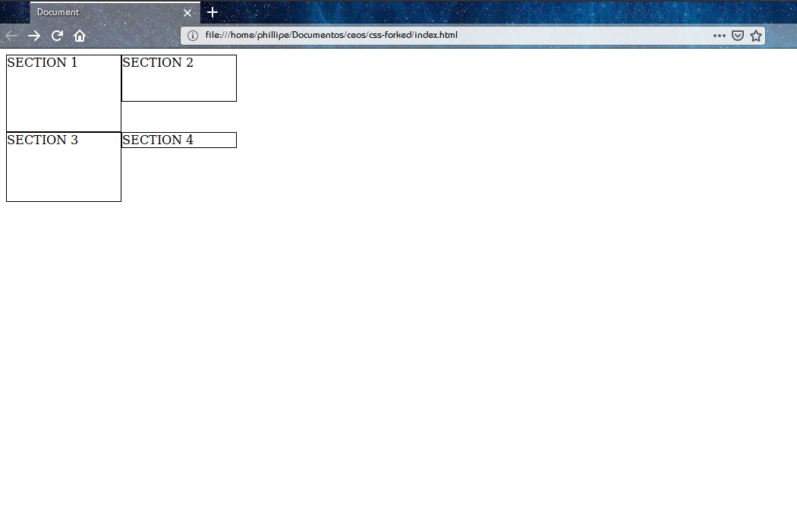

# Posicionamento CSS

O CSS define alguns conceitos que permitem você mover elementos para construção de layouts. Antes de começarmos a posicionar elementos, precisamos entender alguns comportamentos padrões quando você adiciona tags para o seu documento.

Você está la escrevendo seu HTML, colocando tags e mais tags que seguem um valor semântico interessante para o conteúdo do site. No momento não é adicionado nenhuma folha de estilo para a página. Então você abre no seu navegador o HTML e observa que alguns elementos ficaram em uma mesma linha horizontal imaginária, enquanto outros ficaram um abaixo do outro. Formalizando esse comportamento, temos:

**Elementos nível de bloco**: são aqueles que ao ser declarado, serão renderizados um abaixo do outro. Sua largura busca se expandir ao tamanho do elemento pai. Esse tipo de elemento pode receber margem superior e inferior. É observado que quando declarada valores para essas margens para os dois elementos que estão um abaixo do outro, a distância deles será:

- Se as duas margens forem valores positivos, a distância será o maior valor de margem. Por exemplo, o elemento 1 tem margem inferior e superior de 40px, enquanto o elemento 2 tem 50px. Logo, a distância de 1 para 2 será 50px.
- Se as duas margens forem valores negativos, a distância será o maior valor absoluto. Suponha que o elemento 1 tem margem inferior de -40 px, equanto o elemento 2 tem margem superior de -20px. O elemento 2 está abaixo de 1. Logo, a distância entre os dois será -40px;
- Se as duas margens forem valores de sinais opostos, a distância será a soma dos valores. Suponha que o elemento 1 tem margem inferior de 40px, enquanto o elemento 2 tem margem superior de -20px. O elemento 2 está abaixo de 1. Logo a distância entre os dois será de 40px+(-20px) = 20px.

Busque testar esse comportamento e tirar suas próprias conclusões.

**Elementos nível inline**: são aqueles que quando declarado, ficam um ao lado do outro em uma mesma linha horizontal. Esse tipo de elemento só recebe margens a direita e a esquerda;

Pronto, agora temos conhecimento para entender os três tipos de fluxo fornecidos pelo CSS para permitir você criar suas páginas. Eles são:

1. **Fluxo normal**: os elementos seguem o comportamente normal, ou seja, o comportamento explicado acima de elementos nível de bloco e nível inline;

2. **Fluxo absoluto**: o elemento é tirado do fluxo normal e pode ser movido em um sistema de coordenadas;

3. **Fluxo flutado**: os elemetos seguem o comportamento normal, mas "flutuam no elemento pai. Eles sempre buscam o canto superior esquerdo ou direito;

## Posicionamento relativo

No CSS existe a propriedade `position`. Ela pode receber os valores `relative`, `absolute`, `fixed`, `static` e `inherit`. Quando definimos o valor `relative` a um elemento, a página continua com o **fluxo normal**, mas esse elemento passa a ser regido por um sistema de coordenadas em que a origem, ou seja, o ponto (0,0) é o canto superior esquerdo do próprio elemento.


Para mover esse elemento no eixo x, utilizamos a propriedade `left` e `right`. O `left` posiciona a partir da origem do eixo x, enquanto o `right` posiciona a partir do "fim" do eixo x. Para realizar a movimentação no eixo y, usamos a propriedade `top` e `bottom`. O `top` posiciona baseado na origem, enquanto o `bottom` posicona baseado no "fim" do eixo y. Vamos realizar a movimentação de 50px no eixo x e 100px no eixo y:

```html
<p class="my-p">
</p>
```

```css
.my-p {
	position: relative;
	top: 100px;
	left: 50px;
}
```

Teremos algo como mostrado na imagem abaixo:


Nesse tipo de posicionamento, o próximo elemento, não ocupa a posição do elemento que foi definido `position: relative`. Anote bem esse comportamento, porque ele será muito importante no próximo tipo de `position` que iremos explicar.

## Posicionamento absoluto

Definimos um posicionamento absoluto passando para `position` o valor `absolute` ou `fixed`. Ao fazer isso, o comportamento do elemento passar a seguir o fluxo absoluto, ou seja, ele pode ser movido baseado em um eixo de coordenadas e mais importante, o elemento seguinte ocupa sua posição. Antes de mostrar um exemplo, vamos aprender o que é **contexto de posicionamento**.

Lembra que para `position: relative`, a origem do eixo de coordenadas era o canto superior esquerdo da posição inicial do elemento? Esse era o contexto de posicionamento para aquele bloco. Logo podemos concluir que contexto de posicionamento é um mecanismo que estabele a origem do sistema de coordenadas. Para `position: absolute|fixed`, esse mecanismo se baseia em um valor `position` passado para os elementos ancestrais. Caso algum elemento ancestral tenha declarado essa propriedade, a origem do eixo de coordenadas será o canto superior esquerdo desse elemento. Caso não exista, consideramos a origem como o canto superior esquerdo da `viewport`.

**Observação 1**: o sinal `|` significa um ou exclusivo;

**Observação 2**: a `viewport` é a parte do navegador onde é renderizado o conteúdo escrito no html. Ela começa após a barra do navegador em que você digita a url, tem seus favoritos, botão de voltar, etc.

Para o código abaixo temos um posicionamento absoluto cuja origem do sistema de coordenadas é a `viewport`.

```html
<section>
	<p class="my-p">Paragráfo 1</p>
	<p class="my-p">Paragráfo 2</p>
</section>
```

```css
.my-p:nth-child(1) {
	position: absolute;
	top: 150px;
	left: 200px;
}
```


Mas para o código a seguir, temos a origem do sistema de coordenadas sendo o canto superior esquerdo do elemento `section`.

```html
<section>
	<p class="my-p">Paragráfo 1</p>
	<p class="my-p">Paragráfo 2</p>
</section>
```

```css
section {
	position: relative;
}

.my-p:nth-child(1) {
	position: absolute;
	top: 150px;
	left: 200px;
}
```

> **Exercício sugerido**:
> Escreva o código acima e veja a diferença de contexto de posicionamento? Ela é pequena, certo Fixe esse conhecimento que ajudará a resolver grandes problemas.

**Ao declarar `position: fixed`, temos o mesmo comportamento. A diferença encontra-se no fato de que ele fica fixo na `viewport`, ou seja, quando você rolar a página para baixo, ele  tem um efeito de "seguir" o rolamento.**

## Posicionamento float

Diferente dos anteriores, esse tipo de posicionamento não é definido usando a propriedade `position`. Agora vamos utilizar a propriedade `float` que vai fazer os elementos se comportarem como balões cheios de gás helio. "Como assim?", você pode dizer. Calma que vamos explicar isso através de um exemplo.

```html
<section id="section-father">
	<section class="section-child">SECTION 1</section>
	<section class="section-child">SECTION 2</section>
	<section class="section-child">SECTION 3</section>
	<section class="section-child">SECTION 4</section>
</section>
```

```css
#section-father { width: 600px; }

.section-child {
	width: 150px;
	border: 1px solid #000;
	float: left;
}

.section-child:nth-child(1) { height: 100px; }
.section-child:nth-child(2) { height: 60px; }
.section-child:nth-child(3) { height: 90px; }
.section-child:nth-child(4) { height: 95x; }
```


Aqui, todos os filhos de `#section-father` possuem a propriedade `float:left`. Isso faz com que cada elemento busque o topo e o canto esquerdo de seu elemento pai. Observe que o `SECTION 2` vai buscar estar nesse canto, mas como  `SECTION 1` já está la, ele apenas vai ficar ao lado. Um comportamento diferente ocorre com o `SECTION 4`. Isso ocorre por que ele tentar ir para a borda superior do componente pai, mas a largura dele é maior que a largura do pai. Logo, ele vai ficar abaixo dos irmãos. Ele também não enconsta na borda da esquerda de `#section-father` porque `SECTION 1` possui 10px a mais que `SECTION 3`. Como a posição vertical do `SECTION 4` é definida pelo momento que ele encontra o elemento antecessor, quando ele tentar buscar a borda esquerda do elemento pai, ele vai colidir com `SECTION 1`.

> **Exercício sugerido**:
> Repita o exemplo dado anteriormente, mas em vez de todos os elementos possuírem `float: left`. Coloque apenas no `SECTION 2`. O que ocorre?

> **Exercício sugerido**:
> O que ocorre com a altura do elemento pai quando todos os elementos têm `float: left`? Anote esse comportamente, pois ele é a causa comum de quebra de páginas.

Se você respondeu o exercício sugerido anterior, sabe que a altura do elemento pai vai assumir um valor incomum e que os filhos vão ficar fora de sua área. Para quebrar esse comportamento de flutuação dos blocos, o CSS nos disponibiliza a propriedade `clear`. Ela pode receber os valores `right`, `left`, `both` e `inherit`. Isso faz com que o elemento pai volte a ter uma altura.

Vamos pegar o exemplo anterior e definir no `SECTION 3` a propriedade `clear: both`. Então a renderização será:



**Observação**: o valor que você passa para `clear` depende de qual valor você passou para `float`. Utiliza-se normalmente o valor `both` porque  caso seja mudado o valor `float`, o `clear` continua funcionando independente do valor de `float`.

> **Exercício sugerido**:
> Qual valor no exemplo anterior, além de `both`, podemos passar para `clear`?

Fixe cada conteúdo apresentado nessa seção para conseguir um melhor desempenho nas próximas seções.
